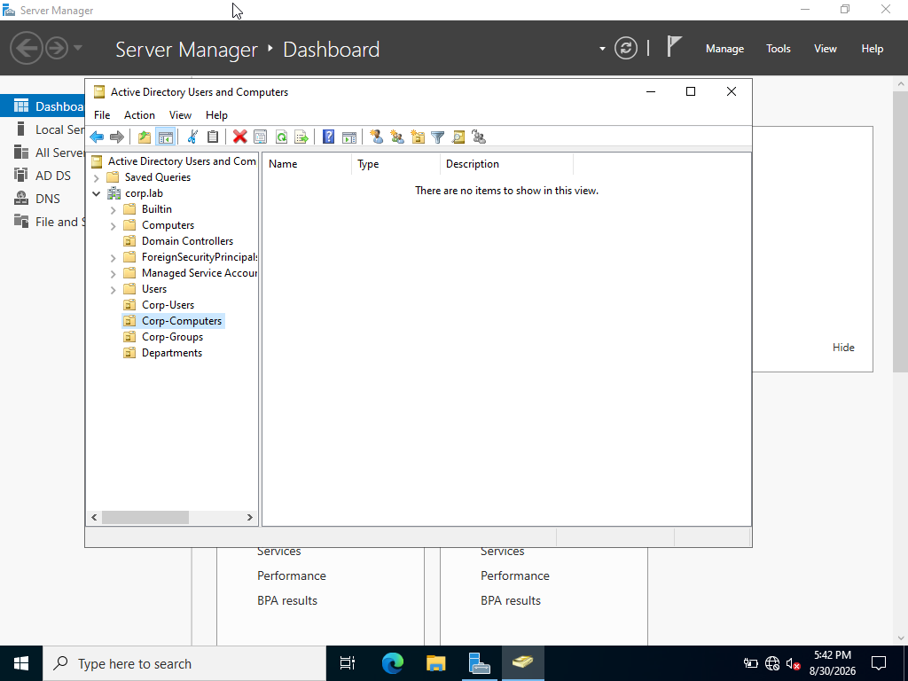
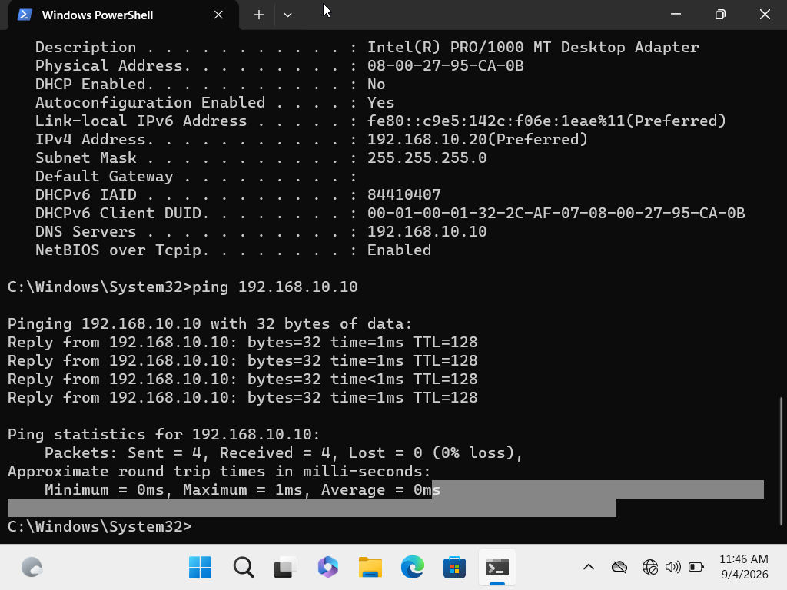
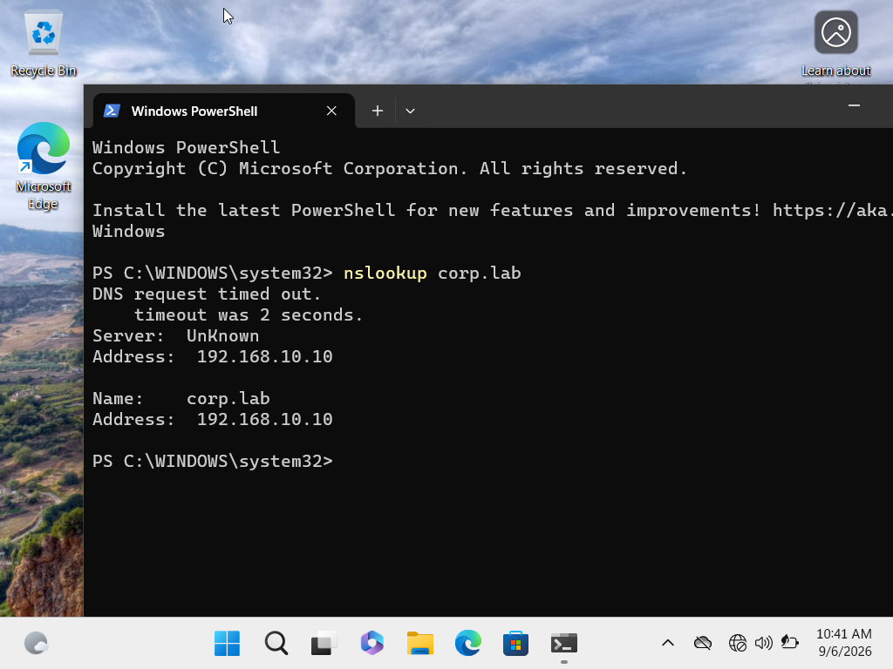
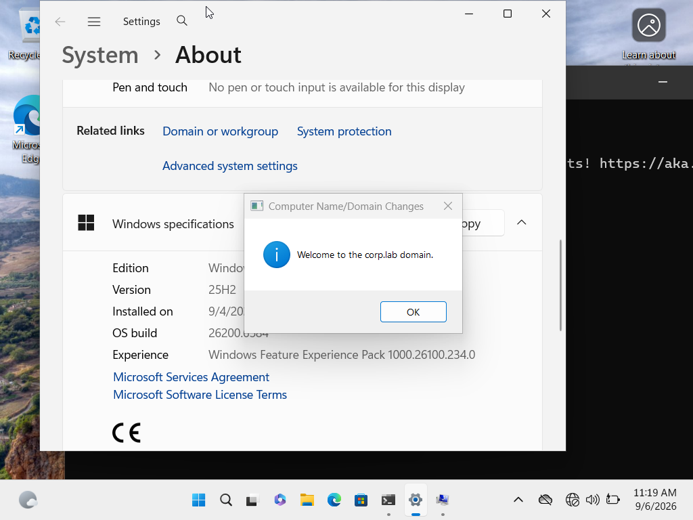
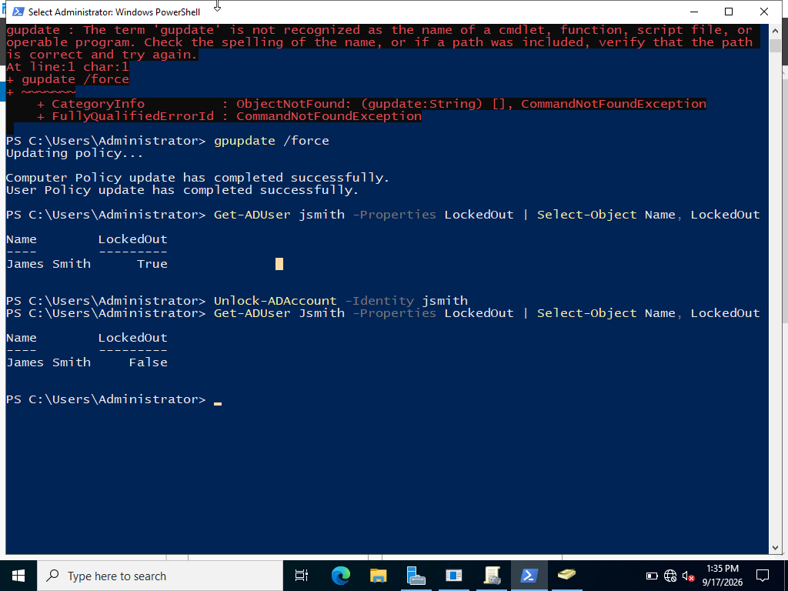
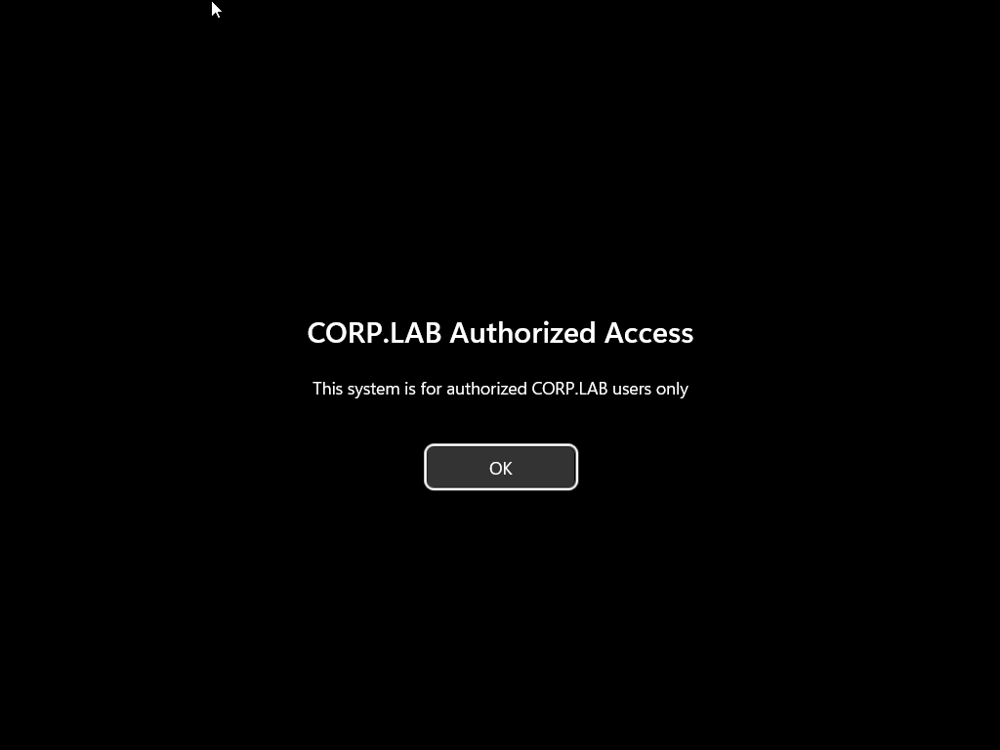
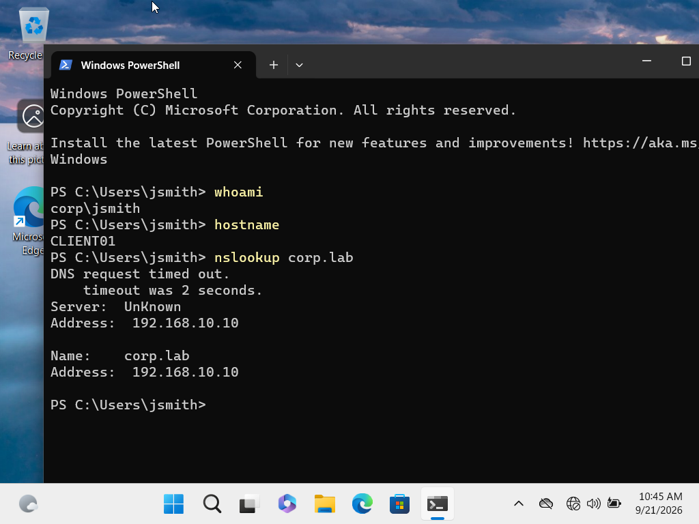

# Active Directory Home Lab

## Overview

I built this home lab to gain hands-on experience with Windows Server, Active Directory, Windows 11 domain environments, and common IT support troubleshooting scenarios.

Using Oracle VirtualBox, I created a Windows Server 2022 domain controller and a Windows 11 client workstation. I configured the `corp.lab` domain, created and managed users and security groups, joined a workstation to the domain, configured DNS and static IP addressing, practiced account troubleshooting, and implemented Group Policy.

The goal of this project was not only to build an Active Directory environment, but also to practice troubleshooting issues that I could encounter in an IT Support or Help Desk role.

---

## Lab Environment

| System | Configuration |
|---|---|
| Hypervisor | Oracle VirtualBox |
| Domain Controller | Windows Server 2022 |
| Client | Windows 11 Enterprise |
| Domain | `corp.lab` |
| Domain Controller | `DC01` |
| Client Workstation | `CLIENT01` |
| DC01 IP Address | `192.168.10.10` |
| CLIENT01 IP Address | `192.168.10.20` |
| DNS Server | `192.168.10.10` |
| Network | `192.168.10.0/24` |

## Active Directory Structure

I organized the domain using Organizational Units (OUs) to separate users, computers, groups, and departments such as IT, HR, Finance, and Sales.

---

## What I Configured

- Installed Windows Server 2022 and configured Active Directory Domain Services (AD DS)
- Created the `corp.lab` Active Directory forest and domain
- Configured `DC01` as the domain controller and DNS server
- Created Organizational Units (OUs) for users, computers, groups, and departments
- Created and managed domain users and security groups
- Configured static IPv4 addressing and DNS
- Installed and configured a Windows 11 Enterprise client
- Joined `CLIENT01` to the `corp.lab` domain
- Verified domain authentication and DNS resolution
- Reset domain user passwords and required password changes at next logon
- Diagnosed and resolved disabled user accounts
- Configured an account lockout policy and troubleshot a locked account
- Used PowerShell to verify and unlock an Active Directory account
- Created and applied a Group Policy Object (GPO) to the Windows 11 workstation

---

## Troubleshooting Experience

During the project, I intentionally created several problems so I could practice diagnosing and resolving them instead of only configuring the environment.

### APIPA / Network Connectivity

CLIENT01 was configured to communicate with DC01 using the lab's internal network. I verified connectivity to the domain controller and confirmed that corp.lab successfully resolved to 192.168.10.10 through DC01. The lookup also showed Server: Unknown, which provided an additional DNS troubleshooting point within the lab.

I used commands such as:

`ipconfig /all`

`ping 192.168.10.10`

`nslookup corp.lab`

### Network and DNS Verification

CLIENT01 was configured to communicate with DC01 using the lab's internal network. I verified connectivity to the domain controller and confirmed that the `corp.lab` domain resolved through DC01's DNS service.

### Domain Authentication Verification

After joining CLIENT01 to the `corp.lab` domain, I successfully logged in using the James Smith domain account. I used `whoami` and `hostname` to verify both the authenticated domain user and workstation.

to verify the network configuration, connectivity to the domain controller, and DNS resolution.

### Active Directory Account Troubleshooting

I practiced several common user account support scenarios, including:

- Disabled user accounts
- Password resets
- Forced password changes
- Account lockouts
- Successful domain login verification

For the account lockout scenario, I configured the domain to lock an account after five unsuccessful login attempts. I then reproduced the issue on CLIENT01 and verified the account status using PowerShell.

Commands used included:

`Get-ADUser jsmith -Properties LockedOut`

`Unlock-ADAccount -Identity jsmith`

After unlocking the account, I verified that the user could successfully authenticate again.

### Account Lockout Resolution

I reproduced an account lockout by intentionally exceeding the configured failed-login threshold. On DC01, I used PowerShell to verify that the account was locked, unlock it, and confirm that the status changed from `True` to `False`.

---

## Group Policy

I created a custom Group Policy Object named:

`CORP - Workstation Security Policy`

I configured an interactive logon message for domain workstations and forced CLIENT01 to retrieve the updated policy using:

`gpupdate /force`

After restarting CLIENT01, the custom CORP.LAB authorized-access message appeared before login, confirming that the policy had successfully applied.

### Group Policy Verification

After running `gpupdate /force` and restarting CLIENT01, the custom authorized-access message appeared before login. This confirmed that the domain GPO was successfully applied to the workstation.

---

## Skills Practiced

- Active Directory Domain Services
- Windows Server 2022
- Windows 11 Administration
- User and Group Management
- Organizational Units
- Group Policy
- DNS
- IPv4 Addressing
- Domain Joining
- Authentication Troubleshooting
- Account Lockout Troubleshooting
- PowerShell
- Command Prompt
- VirtualBox
- IT Support Troubleshooting
- Technical Documentation

---

## Final Lab Verification

At the end of the project, I performed a final verification from CLIENT01. I confirmed the authenticated domain user, workstation hostname, and DNS resolution for `corp.lab`.

Additional screenshots documenting the complete build process are included in this repository.

---

## Key Takeaway

This project gave me hands-on experience building and supporting a Windows domain environment. More importantly, it helped me practice troubleshooting instead of simply following configuration steps.

I worked through networking, DNS, authentication, password, account lockout, and Group Policy scenarios and verified each solution before moving forward.
